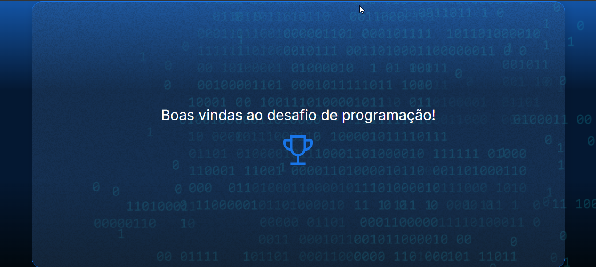

<h1 align="center"></img></h1>

<h1 align="center"> Desafios do curso de lógica de programação </h1>

Praticar a lógica de programação, incluindo conceitos como variáveis, condicionais (if-else), loops (while) e interações com o usuário (alert, prompt), é essencial para sua carreira de desenvolvimento de software. Esses fundamentos fornecem a base para resolver problemas de forma estruturada, tomar decisões no código, criar iterações controladas e interagir eficazmente com os usuários. 

Compreender esses conceitos não apenas facilita o aprendizado de novas linguagens e tecnologias, mas também capacita você a criar soluções inovadoras, depurar eficientemente e manter a qualidade ao longo do ciclo de vida do software. Portanto, investir tempo nesses princípios desde cedo é fundamental para construir uma base sólida e bem-sucedida no campo da programação.

## Documentação
Alguns links úteis para a documentação oficial do JavaScript incluem:

- 💹 **A documentação da linguagem de programação JavaScript** — [A documentação da linguagem de programação JavaScript](https://developer.mozilla.org/pt-BR/docs/Learn_web_development/Core/Scripting/What_is_JavaScript)
- 💹 **Guia de JavaScript: o que é e como aprender a linguagem mais popular do mundo?** — [Guia de JavaScript: o que é e como aprender a linguagem mais popular do mundo?](https://www.alura.com.br/artigos/javascript)